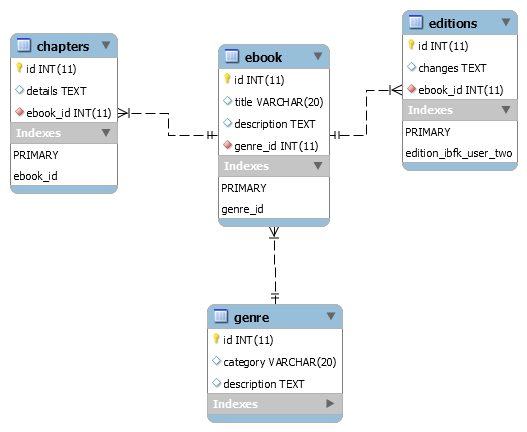

# installing and configuraing boolshelf

bookshelf is compleatly dependent on knex 
install knex and bookshelf 

# configuring book shelf
import knex and book shelf in you project
<pre>
    const knex = require('knex')({
    client: 'mysql',
    connection: {
        host: '127.0.0.1',
        user: 'apptwo',
        password: '123456789',
        database: 'apptwo'
    }});
    const bookshelf = require('bookshelf')(knex);
</pre>

# logging queries excuied by 
add event listner on knex object
<pre>
 knex.on( 'query', function( queryData ) {
  console.log( "--------------Query data--------------------" );
  console.log( queryData.bindings);
  console.log( queryData.sql);
  console.log( "----------------------------------------" );
});
</pre>

# 1) BASIC OPERATIONS
- working with only two tables (ont to manyy)

## 1. create migrations 
create migrations
run migrations and create tables
<pre>
knex migrate:make create_authors_table

        exports.up = function(knex) {
            return knex.schema
            .dropTableIfExists('authors')
            .createTable('authors', function(t) {
                t.increments().primary()
        
                t.string('authorName', 255).notNullable()
                t.string('email', 255).notNullable()
                t.string('password', 255).notNullable()
                t.boolean('account_verified').notNullable().defaultTo(false)
                t.timestamp('created_at').defaultTo(knex.fn.now())
                t.timestamp('updated_at').defaultTo(knex.fn.now())

            });
        };

        exports.down = function(knex) {
            return knex.schema.dropTable('authors');
        };

knex migrate:make create_books_table

        exports.up = function(knex) {
            return knex.schema.createTable('books', function(t) {
                t.increments().primary()
                t.string('title', 255).notNullable()
                t.string('description', 255).notNullable(),
                t.integer('author_id',11).unsigned().notNullable();  
                t.foreign('author_id').references('id').inTable('authors');
            });
        };

        exports.down = function(knex) {
            return knex.schema.dropTable('books');
        };

</pre>
run migrations to create tables authos and books
knex migrate:up 

# simple CRUD : 
creae bookshelf models to do crud operations
create and export bookshelf model to access all over the application

<pre>
module.exports = bookshelf.model('Author', {
    tableName: 'authors',
    book() {
      return this.hasMany('Book')
    }
  });

  module.exports = bookshelf.model('Book', {
    tableName: 'books',
    author() {
        return this.belongsTo("Author");
    }
  });

// Retrieving a previously registered model
const Author = bookshelf.model('Author')
const Book = bookshelf.model('Book')

</pre>

### CREATE database record

1) using static method
<pre>
    var bookModel = Book.forge({title:'html 360',description:"comprehensive spring",author_id:40})
.save()
.then(function(savedModel) {console.log(savedModel.toJSON())})
.catch(function (error) { console.log(error)});
</pre>

2) using constructure
<pre>
    var bookModel = new Book({title:'html 180',description:"comprehensive spring",author_id:40})
.save()
.then(function(savedModel) {console.log(savedModel.toJSON())})
.catch(function (error) { console.log(error)});
</pre>
  
3) using async 
<pre>
    var savedModel = await new Book({title:'html 180',description:"comprehensive spring",author_id:40})
    .save();
    console.log(savedModel.toJSON())
</pre>

### example 2

<pre>
//1) first storing author data (pK table)
 let authodData = {
    authorName: 'mystaq Ahamed',
    email:'mustaq@gmail.com',
    password:'arshiya@12'
  }

  var AuthorModal = Author.forge(authodData).save().then(
    function(savedModel) {
      console.log(savedModel);
    }).catch(function (error) {
			  console.log(error);
	 });

//2) storing child data (Fk table)
Bookook.forge({title:'html 360',description:"comprehensive spring",author_id:authodData.get(id)})
   .save()
  .then(function(savedModel) {console.log(savedModel.toJSON())})
  .catch(function (error) { console.log(error)});

</pre>

## UPDATE record

<pre>
//updating data 
  var bookModel = Book.forge({id:3})
                      .fetch()
                      .then((dbModel) =>{
                      <b>  dbModel.save(
                          {description:'comprehensive HTML'},
                          {patch: true, method: 'update'}
                        ).then(
                            savedModle=> console.log(savedModle.toJSON())</b>
                            )
                       })
                      .catch(function (error) { console.log(error)});
</pre>

## creating both parent and child records using call backs

<pre>
 Author.forge(formData)
    .save()
    .then((savedAuthor) =>{
              Book.forge({
                  title:'How to win in 10 minits',
                  description:"winning boxing match",
                <b>  author_id:savedAuthor.get('id')}) </b>
              .save()
              .then(function(savedModel) {console.log(savedModel.toJSON())})
              .catch(function (error) { console.log(error)});
          })
    .catch(function (error) {
              console.log(error);
    });

</pre>

## creating child recard using parent referance
<pre>
  Author.forge({id:3})
    .fetch() <b> // 1 fetch parent record </b>
    .then((savedAuthor) =>{
              Book.forge({
                  title:'PVKK MBA guide',
                  description:"comprehensive spring",
                  author_id:savedAuthor.get('id')})
              .save()                 <b>//2 store child recard using parent id </b>
              .then(function(savedModel) {console.log(savedModel.toJSON())})
              .catch(function (error) { console.log(error)});
          })
    .catch(function (error) {
              console.log(error);
    });
</pre>

## Selectiong booth parent and child record 

<pre>
    Author.forge({id:1})
        <b>  .fetch({ withRelated:['book']})  </b>
        .then((data)=>{
            console.log(data.get('authorName'));
            console.log(JSON.stringify(data));
            })
        .catch(function (error) {
            console.log(error);
        });
</pre>

## selection fk and pk data at once
<pre>
// fetching book (fk) along with author(pk) 
  Book.forge({id:1})
     <b> .fetch({ withRelated:['author']}) </b>
      .then((data)=>{console.log(JSON.stringify(data)) })
      .catch(function (error) { console.log(error) });
</pre>

## deleting data

<pre>
    allData = await new Author({id:2}).destroy()
    console.log(allData.toJSON());

  new Author({id: 3})
  .destroy()
  .then(function(model) {
    console.log(model.toJSON());
  });

</pre>

## updating data with patch otion

<pre>
  var bookModel = Book.forge({id:3})
                      .fetch()
                      .then((dbModel) =>{
                        dbModel.save(
                          {description:'comprehensive HTML'},
                        <b>  {patch: true, method: 'update'}</b>
                        ).then(savedModle=> console.log(savedModle.toJSON()))
                       })
                      .catch(function (error) { console.log(error)});
</pre>

# storing both pk and fk record
<pre>

    Author.forge(formData)
    .save()
    .then((savedAuthor) =>{
              Book.forge({
                  title:'How to win in 10 minits',
                  description:"winning boxing match",
                  author_id:savedAuthor.get('id')})
              .save()
              .then(function(savedModel) {console.log(savedModel.toJSON())})
              .catch(function (error) { console.log(error)});
          })
    .catch(function (error) {
              console.log(error);
    });
</pre>

# creating Forign key table record
<pre>
    Author.forge({id:3})
    .fetch()
    .then((savedAuthor) =>{
              Book.forge({
                  title:'PVKK MBA guide',
                  description:"comprehensive spring",
                  author_id:savedAuthor.get('id')})
              .save()
              .then(function(savedModel) {console.log(savedModel.toJSON())})
              .catch(function (error) { console.log(error)});
          })
    .catch(function (error) {
              console.log(error);
    });
</pre>

# creating Forign key table record

<pre>
Author.forge({id:1})
      .fetch({ withRelated:['book']})
      .then((data)=>{
          console.log(data.get('authorName'));
          console.log(JSON.stringify(data));
         
        })
        .catch(function (error) {
          console.log(error);
         
        });
</pre>

# bulk Operations 
## bulk insert

<pre>
// 1. create model
var Promise = require('bluebird');

module.exports = bookshelf.model('Author', {
  tableName: 'authors',
  book() {
    return this.hasMany('Book')
  }
});
//2) import modle
const Author = bookshelf.model('Author')

//3) create collection 

 var AuthorCollection = bookshelf.Collection.extend({
         model: Author
 });

//4) create collection
    var authorsCollection = await AuthorCollection.forge([
      { authorName: 'mystaq Ahamed', email:'mustaq@gmail.com', password:'arshiya@12' },
      { authorName: 'scott john', email:'scott@gmail.com', password:'scott@12' },
      { authorName: 'john black', email:'mustaq@gmail.com', password:'john@12' }
   
    ]);

//  let resp = await authorsCollection.invokeThen('save');
//console.log(resp);

// user promis to invoke bulk save
    Promise.all(authorsCollection.invokeThen('save')).then(function(result ) {
        result.forEach(e=>console.log(e.toJSON()))
    });

 
</pre>

# bulk delet
<pre>
        let  allData = await new  Author().fetchAll();
        // console.log(allData);
        allData.invokeThen('destroy').then(function() {
            console.log('all models in the collection have been destroyed');
        });

</pre>
with out using new operator
<pre>
      let AllAutohors = await Author.collection().fetch();
        Promise.all(AllAutohors.invokeThen('destroy')).then(function(result ) {
          result.forEach(e=>console.log(e.toJSON()))
        });
</pre>

# deleting dependent modlels
<pre>
let autho = await new Author({id:40}).fetch({
  withRelated:['book']
});

Promise.all(autho.related('book').invokeThen('destroy')).then(function(result ) {
  result.forEach(e=>console.log(e.toJSON()))
});

</pre>
# QUERING DATA from tables
getting multiple records

<pre>
    // let  allData = await new Customer().fetchPage({pageSize: 3, page: 2});
    // let  allData = await Customer.collection().fetch();
    // let  allData = await new  Customer().fetchAll();
</pre>

## getting singlrecord

<pre>    // let  allData = await new  Customer().fetch();  // get single modle </pre>

## using where clos

<pre>

    // let  allData = await Customer.collection()
    //                   //.where('postalCode', '<>', '58339')
                          //.where('postalCode', '!=', '58339')   

    //                   //.where('postalCode', '=', '58339')
    //                   //.where('postalCode', '58339')

    //                 
    //                   // .where({postalCode: '94217', city: "Burlingame"})
    //                   // .where('postalCode', '=', '58339')
    //                   .andWhere('postalCode', '=', '58390')

    //                   .fetch();
</pre>

## quering using query operator
<pre>
    //allData = await Customer.query('where', 'postalCode', '=', '58339').fetch();
   allData = await Customer.query('where', 'city', '=', 'Newark').fetchAll({withRelated: ['emp']});
   allData.forEach(e=>console.log(e.toJSON()));
</pre>

## cunting 

<pre>
  try {
    let  totalBooks = await Book.count();
    console.log(totalBooks);
  } catch (error) {
    
  }
</pre>

# 1) Intermediat OPERATIONS
- working with only two tables (ont to manyy)

 

## create sql schema

<pre>
  use apptwo;

  
  CREATE TABLE`genre` (
	`id`  INT NOT NULL AUTO_INCREMENT,
    `category` VARCHAR( 20 )  ,
    `description` TEXT  ,
    PRIMARY KEY ( `id` )
 )  ENGINE=INNODB;
insert  into `genre`(`id`,`category`,`description`) values 
('1','basic','This book is for advance learner'),
('2','intermediat','for intermediat ');

CREATE TABLE`ebook` (
	`id`  INT NOT NULL AUTO_INCREMENT,
    `title` VARCHAR( 20 )  ,
    `description` TEXT ,
     `genre_id`   INT NOT NULL,
         PRIMARY KEY ( `id` ),
		KEY `genre_id` (`genre_id`),
		CONSTRAINT `edition_ibfk_genere` FOREIGN KEY (`genre_id`) REFERENCES `genre`(`id`)
)  ENGINE=INNODB;
 
insert  into `ebook`(`id`,`title`,`description`,`genre_id`) values 
('1','working with java','Learn java programin',1),
('2','learn c++','programin in c++',1);

CREATE TABLE`editions` (
	`id`  INT NOT NULL AUTO_INCREMENT,
     `changes` TEXT  ,
   `ebook_id` INT NOT NULL ,
   PRIMARY KEY ( `id` ),
 	CONSTRAINT `edition_ibfk_user_two` FOREIGN KEY (`ebook_id`) REFERENCES `ebook`(`id`)
	
 )  ENGINE=INNODB;
 

insert  into `editions`(`id`,`changes`,`ebook_id`) values 
('1','added closers in to the book','1'),
('2','added mataprogramin in chapter two','1');

CREATE TABLE`chapters` (
	`id`  INT NOT NULL AUTO_INCREMENT,
	`details` TEXT  ,
   `ebook_id`  INT NOT NULL ,
    KEY `ebook_id` (`ebook_id`),
	CONSTRAINT `edition_ibfk_user_fke` FOREIGN KEY (`ebook_id`) REFERENCES `ebook` (`id`),
	PRIMARY KEY ( `id` )
 )  ENGINE=INNODB;
 
insert  into `chapters`(`id`,`details`,`ebook_id`) values 
('1','introduction to java','1'),
('2','about Jvm ','1'),
('3','what is c','2'),
('4','diferance between c and c++','2'),
('5','first c program','2'),
('6','control statements ','2');

</pre>

create modelse to work

<pre> 

let Genre = bookshelf.model('Genre', {
  tableName: 'genre',
  ebook() {
    return this.hasMany('Ebook');
  }
});

let Edition = bookshelf.model('Edition', {
  tableName: 'editions',
  ebook: function() {
    return this.belongsTo('Ebook'); 
  }
});

let Chapter = bookshelf.model('Chapter', {
  tableName: 'chapters',
  ebook: function() {
    return this.belongsTo('Ebook');
  }
});

let Ebook = bookshelf.model('Ebook', {
  tableName: 'ebook',
   editions: function() {
    return this.hasMany('Edition');
  },
  chapters: function() {
    return this.hasMany('Chapter');
  },
  genre: function() {
    return this.belongsTo('Genre');
  }
});

</pre>

###  Quering data
1) all generous
<pre>
  try {
    let  allGere = await Genre.fetchAll({debug:true,require: true});  //debug=false
   // console.log(allGere); <b> //CollectionBase</b>
    // allGere.forEach(e=>console.log(e));<b>//ModelBase </b>
    allGere.forEach(e=>console.log(e.toJSON())) <b> // convert modelbase to json</b>
  } catch (error) {
    <b> // handleing error</b>
  }
</pre>
2) get ebook
<pre>
    try {
    let ebook1 = await Ebook.where({id: 1}).fetch(); <b>//returns ModelBase </b>
    console.log(ebook1.toJSON());
    } catch (error) {
    
    }
</pre>
3) fetching with genera
<pre>
  try {
    let ebook1 = await new Ebookmobi({id:2}).fetch({withRelated: ['genre']} );
    console.log(ebook1.toJSON());
  } catch (error) {
    console.log(error);
  }
</pre>

4) fetching data form three dependent tables
<pre>
try {
  let ebook1 = await new Ebookmobi({id:2}).fetch({withRelated: ['genre','editions','chapters']} );
  console.log(ebook1.toJSON());
} catch (error) {
  console.log(error);
}
</pre>

5) altering the query for one to many recards to display

<pre>

        try {
        let ebook1 = await new Ebookmobi({id:1})
                            .fetch({
                            withRelated: ['genre',
                            { editions: (query)=>query.orderBy('id','DESC')},
                            { chapters: (query)=>query.orderBy('id','DESC')}
                            ]
                            } );
        console.log(ebook1.toJSON());
        } catch (error) {
        console.log(error);
        }

</pre>

# createing different module  for different plotform
- insing restrection we can hide some properties

<pre>
    // restricted data usage create new model with hidden filds
    let Ebookmobi = bookshelf.model('Ebookmobi', {
    tableName: 'ebook',
    hidden: ['genre_id'],
    //visible: ['title:', 'description:'],
    editions: function() {
        return this.hasMany('Edition');
    },
    chapters: function() {
        return this.hasMany('Chapter');
    },
    genre: function() {
        return this.belongsTo('Genre');
    }
    });
</pre>

# III UNDERSTANDING MAPING

>NOTE: offieces table contain officeCodeid  whic is PK
>employees table contains officeCode as FK to the officecodeid (offieces table)
<pre>
let Emp = bookshelf.model('Emp', {
        tableName: 'employees',
        offiece() {
            return this.belongsTo('Offiece','officeCode','officeCodeid');  
        },
        
        initialize() {
            this.on('fetched:collection', (collection) => {
                console.log(`fetched employess`)
            });
            this.on('fetching:collection', (collection) => {
            console.log(`fetching employess`)
        });
 }
});
</pre>

note:  hasMany(Target, foreignKey, foreignKeyTarget) {
officeCodeid is present in offiece table  as pk
<pre>
let Offiece = bookshelf.model('Offiece', {
  tableName: 'offices',
  idAttribute : 'officeCodeid',
  emp() {
    return this.hasMany('Emp','officeCode','officeCodeid')
  }
});
</pre>
creating relation between customers and employees
<pre>
let Customer = bookshelf.model('Customer', {
  tableName: 'customers',
  idAttribute : 'customerNumber',
  emp() {
    return this.belongsTo('Emp','salesRepEmployeeNumber','employeeNumber')
  }
});

</pre>

# working with three tables with custom Id keys

 counting
<pre>
    let countEMP = await Emp.count();
    console.log(countEMP);
</pre>

fetchec all the empoloyees with offiece data

<pre>
  let  allData = await new  Emp().fetchAll({withRelated: ['offiece']});
    console.log(allData.toJSON())
</pre>

fetching with single emp with employee number

<pre>
  try {
    let  allEMp = await new Emp({ employeeNumber: 1621}).fetch(
      {withRelated: ['offiece']}
    );
    console.log(allEMp.toJSON())
  } catch (error) {
      console.log(error);
}
</pre>

using wahere clas
<pre>

let  allData = await new  Emp().query('where', 'employeeNumber', '=', '1002').fetchAll();
//console.log(allData.toJSON());
  allData.forEach(e=>console.log(e.toJson()));
</pre>
 get all the employes and only offiece is bosten data
<pre>
    let  allData = await new  Emp().fetchAll({
        withRelated: [{
        offiece:function(qb){
            qb.where('city','=','Boston');
        }
        }]
    });
    allData.forEach(e=>console.log(e.toJSON()));
</pre>

select all the emploes who reports to 1056 and 1057
<pre>

  try {
    let  allEMp = await  Emp.where('reportsTo', 'IN', [1056,1057]).fetchAll( {withRelated: ['offiece']});;
    console.log(allEMp.toJSON());
  } catch (error) {
      console.log(error);
}

</pre>
<pre>
try {
  let  allEMp = await  Offiece.where('officeCodeid', 'IN', [1,2])
                  .fetchAll( {withRelated: ['emp']});;
  console.log(allEMp.toJSON());
} catch (error) {
    console.log(error);
}

</pre> 

get all offieces with emp with jobtitle sales rep
ge the offieces along with sales rep 
<pre>
    try {
      let  allEMp = await  Offiece.fetchAll(
                     {withRelated:[{ emp : function(qb) { qb.where('jobTitle', 'Sales Rep')} }] }
                     );
      console.log(allEMp.toJSON());
    } catch (error) {
        console.log(error);
  }
  
</pre>

quering with joins

<pre>
 try {
    let  allData = await new  Emp().query(
      (qb)=>{  
          qb.innerJoin('offices', 'officeCodeid', 'officeCode')
         // qb.where('city','Boston') //if you wanted
          qb.where('offices.city','Boston') //if you wanted
          qb.andWhere('employeeNumber',1188);  //and if you wanted more
        //  qb.limit(10);
        }
    ).fetchAll({columns: ['employeeNumber', 'lastName', 'firstName']});
    
        // console.log(allData);
        console.log(allData.toJSON());
      } catch (error) {
          console.log(error);
    }
    
</pre>

# advance quering

<pre>
try {
  
  let  allData = await new Emp().query((q)=>{
    q.innerJoin('offices', 'officeCodeid', 'officeCode')
    //q.where('city','=','Boston')
    // q.where('firstName','=','Diane')
    q.where('employees.firstName','=','Diane')
   
    // q.innerJoin('customers', 'customersId', 'customers')
  // }).fetch({columns:['employeeNumber', 'lastName','offices.officeCodeid'],withRelated: ['offiece']});
  }).fetch({withRelated: ['offiece']});
  console.log(allData.toJSON());

} catch (error) {
  console.log(error)
}
  

</pre>

<pre>

  let  allData = await new Offiece().query((q)=>{
    q.innerJoin('employees','officeCode', 'officeCodeid' )
    q.where('city','=','Boston')
    
  
  }).fetch({withRelated: [{
    'emp':(qr)=>{qr.orderBy('employeeNumber','desc')}
  }]});
  console.log(allData.toJSON());

} catch (error) {
  console.log(error)
}
  
</pre>
